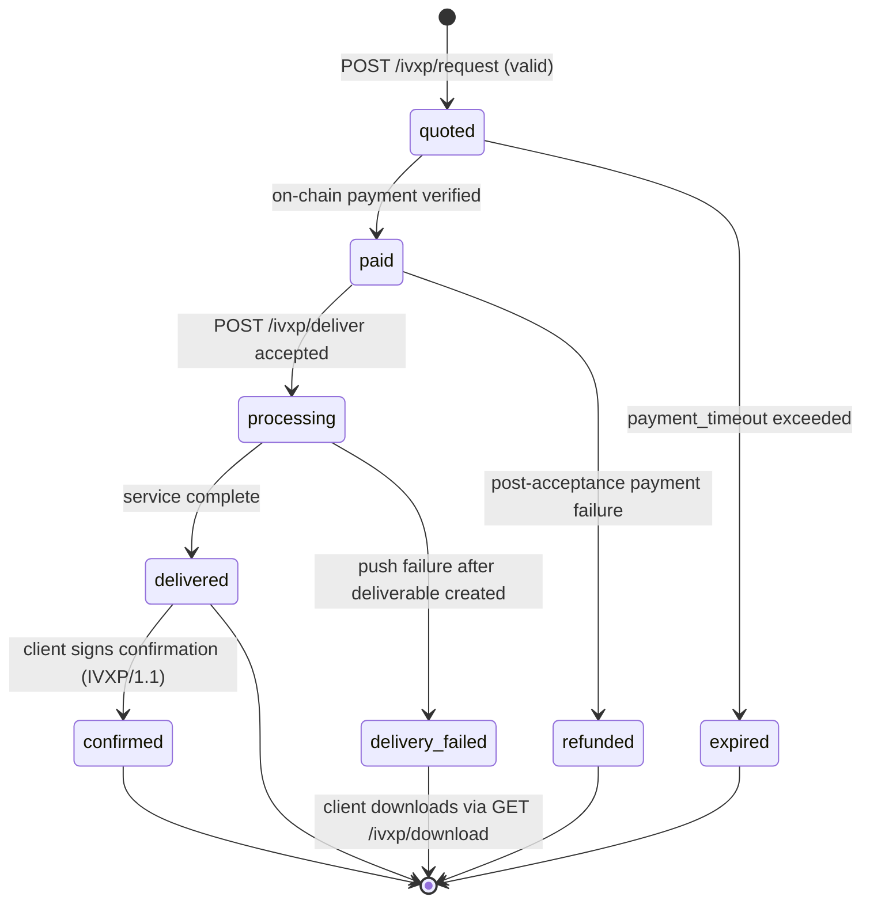

### 5.1 State Machine

### 5.2 State Descriptions and Wire Visibility

| State             | Description                                                                     | Terminal | Exposed by `GET /ivxp/status` in IVXP/1.0 |
| ----------------- | ------------------------------------------------------------------------------- | -------- | ----------------------------------------- |
| `quoted`          | Quote issued, awaiting payment                                                  | No       | Yes                                       |
| `paid`            | Payment verified on-chain, awaiting delivery request                            | No       | Yes                                       |
| `processing`      | Service handler actively executing                                              | No       | Yes                                       |
| `delivered`       | Deliverable ready (P2P push succeeded or stored)                                | Yes\*    | Yes                                       |
| `delivery_failed` | P2P push failed after deliverable creation; deliverable is downloadable via GET | Yes      | Yes                                       |
| `confirmed`       | Client signed receipt confirmation (IVXP/1.1)                                   | Yes      | No (IVXP/1.1 capability)                  |
| `expired`         | Payment timeout exceeded                                                        | Yes      | No (provider internal in IVXP/1.0)        |
| `refunded`        | Payment verification failed after acceptance                                    | Yes      | No (provider internal in IVXP/1.0)        |

\*`delivered` is terminal in IVXP/1.0. In IVXP/1.1, it transitions to `confirmed`.

In IVXP/1.0, the normative `OrderStatusResponse.status` enum is exactly: `quoted`, `paid`, `processing`, `delivered`, `delivery_failed`.

### 5.3 State Transitions

#### `[*]` → `quoted`

**Trigger:** Provider receives a valid `ServiceRequest` via `POST /ivxp/request`.

**Conditions:**

- `protocol` must be `"IVXP/1.0"`
- `service_request.type` must exist in the Provider's catalog
- `service_request.budget_usdc` must be >= the service's `base_price_usdc`

**Actions:** Provider generates `order_id` (`ivxp-{uuid-v4}`), stores the order, returns `ServiceQuote`.

#### `quoted` → `paid`

**Trigger:** Client submits `POST /ivxp/deliver` with valid `PaymentProof` and signature.

**Conditions:** All payment verification checks pass (see Section 4.3). Payment must arrive within `terms.payment_timeout` (default: 3600 seconds).

#### `paid` → `processing`

**Trigger:** Provider accepts the delivery request and begins executing the service handler.

**Actions:** Provider responds with `DeliveryAccepted { status: "accepted" }`.

#### `processing` → `delivered`

**Trigger:** Service handler completes successfully.

**Actions:** Provider computes `content_hash` (SHA-256 of `JSON.stringify(deliverable.content)`). If `delivery_endpoint` was provided, Provider attempts P2P push. On success or if no endpoint was provided, status becomes `delivered` and deliverable is stored for download.

#### `processing` → `delivery_failed`

**Trigger:** P2P push to `delivery_endpoint` fails after the deliverable has been generated and stored.

**Recovery:** Client polls `GET /ivxp/status/{order_id}` and then downloads via `GET /ivxp/download/{order_id}`.

#### Processing failure before deliverable creation

If the service handler fails before a deliverable exists, Providers must not claim Store-and-Forward availability for that order. Providers should return `INTERNAL_ERROR` (or a domain-specific error) and keep failure handling explicit in API responses.

#### `quoted` → `expired`

**Trigger:** `terms.payment_timeout` seconds elapse without a valid delivery request.

**Default timeout:** 3600 seconds (1 hour). Providers must always enforce a timeout; there is no infinite timeout.

**Wire visibility note:** In IVXP/1.0, expiration is surfaced through endpoint behavior (for example, rejecting late delivery with an expiration error), while `GET /ivxp/status/{order_id}` stays within the IVXP/1.0 status enum.

### 5.4 Store and Forward Guarantee

IVXP requires Providers to store deliverables regardless of P2P push success. This means:

- A `delivery_failed` order does not mean the service failed — it means the push failed.
- The Client can always retrieve the deliverable via `GET /ivxp/download/{order_id}`.
- Providers must retain deliverables for at least 24 hours after `delivered` or `delivery_failed`. A retention period of 7 days is recommended.

When the retention window has elapsed, Providers should return `410` with `ORDER_EXPIRED` for `GET /ivxp/download/{order_id}` and include `details.reason = "delivery_retention_elapsed"`.

For the complete state machine specification, see [state-machine.md](./state-machine.md).

---

