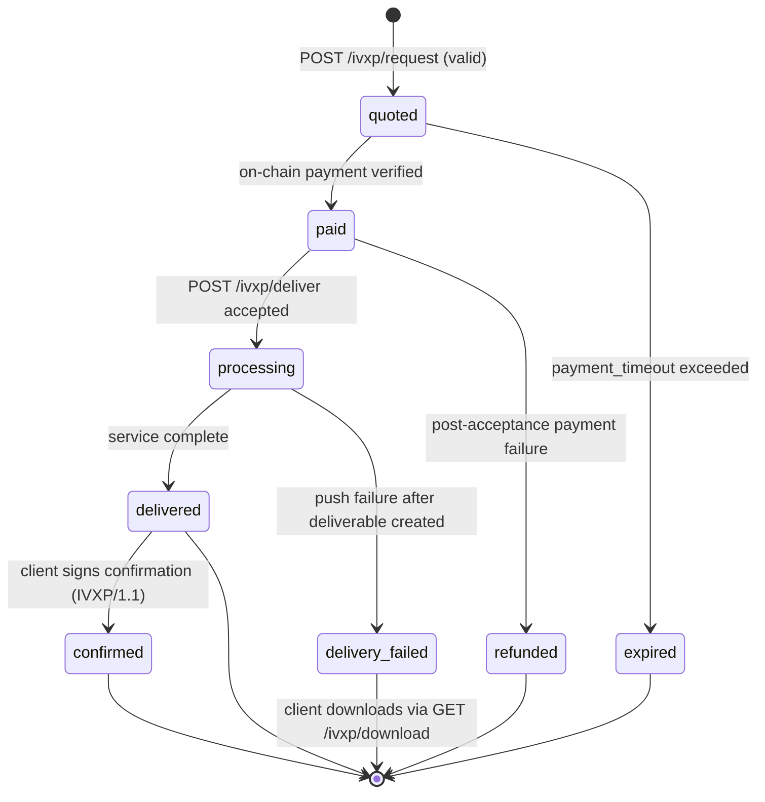

# IVXP Protocol Specification

**Version:** IVXP/1.0
**Status:** Draft
**Audience:** Framework developers, SDK implementors, protocol architects

---

## Table of Contents

1. [What is IVXP](#1-what-is-ivxp)
2. [Design Principles](#2-design-principles)
3. [Protocol Architecture](#3-protocol-architecture)
4. [Integration Contract](#4-integration-contract)
5. [Order Lifecycle](#5-order-lifecycle)
6. [Wire Protocol](#6-wire-protocol)
7. [Security Model](#7-security-model)
8. [Reference Implementations](#8-reference-implementations)
9. [Conformance Requirements](#9-conformance-requirements)

---

## 1. What is IVXP

**IVXP (Intelligence Value Exchange Protocol) is an independent economic settlement layer for AI Agents.**

It defines a standard for how any two AI Agents — regardless of the communication framework they use — can exchange paid services with cryptographic guarantees: verifiable payment, verifiable identity, and verifiable delivery.

### 1.1 The Problem IVXP Solves

As AI Agents become capable of autonomous work, they need to buy and sell capabilities from each other. The missing piece is not communication (A2A, MCP, and similar protocols handle that) — it is _economic exchange_: how does an Agent pay another Agent for a service, with no trusted intermediary, no platform account, and no manual settlement?

IVXP answers this with a concrete protocol:

- A **Client Agent** discovers a service, receives a price quote, pays in USDC on Base L2, and downloads the result.
- A **Provider Agent** receives the request, issues a quote, verifies the on-chain payment, executes the service, and delivers the result.
- Every step is backed by cryptographic proof. No party needs to trust the other's claims.

### 1.2 What IVXP Is Not

| IVXP is NOT...                             | Because...                                                                                                         |
| ------------------------------------------ | ------------------------------------------------------------------------------------------------------------------ |
| A communication protocol                   | It does not define how Agents discover each other or exchange messages in general. Use A2A, MCP, or HTTP for that. |
| An Agent framework                         | It does not define Agent behavior, memory, or tool use.                                                            |
| An extension of A2A or any other framework | IVXP is a peer protocol. A2A, LangGraph, AutoGen, and CrewAI are equal implementors of IVXP, not its hosts.        |
| A centralized payment platform             | There is no IVXP payment processor. Payments settle on-chain via USDC.                                             |

### 1.3 Position in the Agent Protocol Stack

IVXP sits as a **horizontal economic layer** that spans all Agent communication frameworks:

```text
┌─────────────────────────────────────────────────────────────────┐
│                    Agent Application Layer                       │
│                    (Business Logic / Workflows)                  │
├──────────────┬───────────────┬──────────────┬───────────────────┤
│     A2A      │      MCP      │   LangGraph  │  AutoGen / Custom │
│ (comm layer) │  (tool layer) │ (framework)  │  (framework)      │
├──────────────┴───────────────┴──────────────┴───────────────────┤
│                                                                  │
│          IVXP — Independent Economic Settlement Layer            │
│   Service Discovery · Quoting · Payment · Delivery · Integrity  │
│                                                                  │
├──────────────────────────────────────────────────────────────────┤
│          Blockchain Infrastructure (Base L2 / EVM)               │
│          USDC (ERC-20) · EIP-191 Signatures                      │
└──────────────────────────────────────────────────────────────────┘
```

The correct integration direction is: **frameworks implement IVXP adapters**. IVXP does not become a plugin of any framework. This is the same relationship as banks implementing SWIFT adapters — SWIFT is the standard, banks are the implementors.

---

## 2. Design Principles

### P1 — P2P First

Any two Agents holding Ethereum wallets can transact directly. No central authority grants permission to participate. A Provider registers no account; it simply runs an HTTP server and exposes its wallet address. A Client needs no API key; it needs a funded wallet.

### P2 — Cryptographic Trust

IVXP does not ask parties to trust each other's claims. Every critical assertion is backed by math:

- **Payment** is verified by reading the blockchain directly. The Provider checks the `tx_hash` on-chain; the Client's claim about the amount is irrelevant.
- **Identity** is verified by recovering the signer address from an EIP-191 signature. The Client proves it controls the paying wallet without revealing the private key.
- **Delivery integrity** is verified by comparing `content_hash` (SHA-256) against the received deliverable.

### P3 — Protocol Neutrality

IVXP does not depend on any Agent communication framework. An Agent running on A2A, LangGraph, AutoGen, or a custom HTTP stack can all participate in IVXP transactions identically. The protocol is transport-agnostic at the framework level; it requires only HTTPS at the wire level.

### P4 — Permissionless Participation

Holding an Ethereum wallet is the only prerequisite for joining the IVXP network as either a Provider or a Client. There is no registration, no KYC, no approval process. This enables autonomous Agents to participate in economic exchange without human intervention.

### P5 — Backward Compatibility

Protocol extensions must not break existing implementations. All new fields are introduced as optional. The `protocol: "IVXP/1.0"` field in every message allows implementations to detect and handle version differences.

---

## 3. Protocol Architecture

### 3.1 Core Roles

| Role               | Description                                                                                                                                    |
| ------------------ | ---------------------------------------------------------------------------------------------------------------------------------------------- |
| **Provider Agent** | An Agent that offers paid services. Runs an HTTP server implementing the IVXP endpoints. Holds an Ethereum wallet to receive USDC payments.    |
| **Client Agent**   | An Agent (or human-facing application) that consumes paid services. Holds an Ethereum wallet to send USDC payments and sign delivery requests. |

A single Agent may act as both Provider and Client in different transactions.

### 3.2 Core Objects

| Object           | Description                                                                                                                |
| ---------------- | -------------------------------------------------------------------------------------------------------------------------- |
| **Order**        | A single service transaction. Identified by `order_id` (format: `ivxp-{uuid-v4}`). Tracks state from quote to delivery.    |
| **Quote**        | A Provider's response to a service request. Contains `price_usdc`, `payment_address`, and `order_id`.                      |
| **PaymentProof** | The Client's evidence of on-chain payment. Contains `tx_hash`, `from_address`, and `network`.                              |
| **Deliverable**  | The service output. Contains `type`, optional `format`, and `content`. Integrity is verified via `content_hash` (SHA-256). |

### 3.3 The Eight-Step Transaction Model

Every IVXP transaction follows this sequence:

```text
Client Agent                              Provider Agent
     │                                         │
     │  1. GET /ivxp/catalog                   │
     │────────────────────────────────────────>│
     │<──────────── ServiceCatalog ────────────│
     │                                         │
     │  2. POST /ivxp/request                  │
     │     { client_agent, service_request }   │
     │────────────────────────────────────────>│
     │<──────────── ServiceQuote ──────────────│
     │     { order_id, price_usdc,             │
     │       payment_address }                 │
     │                                         │
     │  3. USDC transfer on Base L2            │
     │══════════════> [Blockchain] ════════════│
     │                                         │
     │  4. POST /ivxp/deliver                  │
     │     { order_id, payment_proof,          │
     │       nonce, signature, signed_message }│
     │────────────────────────────────────────>│
     │                                         │
     │  5. Provider verifies payment on-chain  │
     │                    [Blockchain] ════════│
     │                                         │
     │  6. Provider verifies EIP-191 signature │
     │<──────────── DeliveryAccepted ──────────│
     │                                         │
     │  7. GET /ivxp/status/{order_id}         │
     │────────────────────────────────────────>│
     │<──────────── { status: "delivered" } ───│
     │                                         │
     │  8. GET /ivxp/download/{order_id}       │
     │────────────────────────────────────────>│
     │<──────────── DeliveryResponse ──────────│
     │     { deliverable, content_hash }       │
     ▼                                         ▼
```

Steps 7 and 8 may be repeated (polling) until the order reaches a terminal state. If the Provider supports P2P push delivery, step 7 may be skipped — the Provider POSTs the deliverable directly to the Client's `delivery_endpoint`.

---

## 4. Integration Contract

This section defines what an external framework must implement to integrate IVXP. Read this section if you are building an IVXP adapter for A2A, LangGraph, AutoGen, or any other Agent framework.

### 4.1 Integration Direction

The correct integration direction is unambiguous:

```text
✅ CORRECT: External framework implements an IVXP Adapter
           Framework ──[IVXP Adapter]──> IVXP Protocol

❌ WRONG:   IVXP becomes an extension of a framework
           IVXP ──[Extension]──> Framework
```

**Why this matters:** If IVXP were an extension of A2A, then LangGraph Agents, AutoGen Agents, and any non-A2A Agent could never participate in IVXP transactions. The economic network would be fragmented by framework boundaries. By keeping IVXP independent, any Agent from any framework can transact with any other Agent — the network effect accumulates in the protocol, not in any single framework.

The analogy is precise: banks implement SWIFT adapters. SWIFT does not become a feature of any bank's internal system. The same principle applies here.

### 4.2 Minimum Adapter Interface

An IVXP Adapter for a Client-side framework must implement these five operations:

```typescript
interface IVXPClientAdapter {
  /**
   * Fetch the Provider's service catalog.
   * Maps to: GET {providerUrl}/ivxp/catalog
   */
  getCatalog(providerUrl: string): Promise<ServiceCatalog>;

  /**
   * Request a service quote from a Provider.
   * Maps to: POST {providerUrl}/ivxp/request
   * Returns an order_id and price.
   */
  requestQuote(providerUrl: string, request: ServiceRequestDetails): Promise<ServiceQuote>;

  /**
   * Submit payment proof and request delivery.
   * Maps to: POST {providerUrl}/ivxp/deliver
   * Requires: on-chain tx_hash and EIP-191 signature.
   */
  requestDelivery(
    providerUrl: string,
    orderId: string,
    paymentProof: PaymentProof,
    signature: string,
    signedMessage: string,
  ): Promise<DeliveryAccepted>;

  /**
   * Poll order status.
   * Maps to: GET {providerUrl}/ivxp/status/{orderId}
   */
  getStatus(providerUrl: string, orderId: string): Promise<OrderStatusResponse>;

  /**
   * Download the completed deliverable.
   * Maps to: GET {providerUrl}/ivxp/download/{orderId}
   * Only call when status is "delivered" or "delivery_failed".
   */
  download(providerUrl: string, orderId: string): Promise<DeliveryResponse>;
}
```

An IVXP Adapter for a Provider-side framework must implement these five endpoints:

```typescript
interface IVXPProviderAdapter {
  /** GET /ivxp/catalog — return available services and wallet address */
  handleCatalog(): ServiceCatalog;

  /** POST /ivxp/request — validate request, generate order_id, return quote */
  handleRequest(body: ServiceRequest): ServiceQuote;

  /**
   * POST /ivxp/deliver — verify payment on-chain, verify signature,
   * accept order, begin processing
   */
  handleDeliver(body: DeliveryRequest): DeliveryAccepted;

  /** GET /ivxp/status/:orderId — return current order state */
  handleStatus(orderId: string): OrderStatusResponse;

  /** GET /ivxp/download/:orderId — return deliverable when ready */
  handleDownload(orderId: string): DeliveryResponse;
}
```

For complete message type definitions, see [message-formats.md](./message-formats.md).

### 4.3 Identity and Payment Contract

Any IVXP implementation must conform to these identity and payment conventions:

#### Payment Currency and Network

| Parameter               | Value                                                           |
| ----------------------- | --------------------------------------------------------------- |
| Token                   | USDC (ERC-20, 6 decimals)                                       |
| Network (mainnet)       | Base Mainnet — Chain ID `8453`                                  |
| Network (testnet)       | Base Sepolia — Chain ID `84532`                                 |
| USDC contract (mainnet) | `0x833589fCD6eDb6E08f4c7C32D4f71b54bdA02913`                    |
| USDC contract (testnet) | `0x036CbD53842c5426634e7929541eC2318f3dCF7e`                    |
| Raw amount encoding     | `amount_usdc * 10^6` as string (e.g., `"5000000"` for 5.0 USDC) |

#### Identity: EIP-191 Signatures

The Client signs a delivery request message using EIP-191 (`personal_sign`). The signed message format is:

```text
IVXP-DELIVER | Order: {order_id} | Payment: {tx_hash} | Nonce: {nonce} | Timestamp: {timestamp}
```

| Field          | Description                                                 |
| -------------- | ----------------------------------------------------------- |
| `IVXP-DELIVER` | Fixed prefix — prevents cross-protocol replay               |
| `order_id`     | The order identifier from the quote                         |
| `tx_hash`      | The on-chain USDC transaction hash                          |
| `nonce`        | A unique random string (min 16 chars) generated per request |
| `timestamp`    | ISO 8601 timestamp of the delivery request                  |

The Provider recovers the signer address from the signature and verifies it matches `payment_proof.from_address`. See [security.md](./security.md) for the full verification algorithm.

The `DeliveryRequest` payload carries `nonce` as a dedicated field. The Provider must rebuild the canonical message from `order_id`, `payment_proof.tx_hash`, `nonce`, and `timestamp`, and reject requests where `signed_message` does not match this canonical string exactly.

#### Payment Verification

The Provider must verify the payment on-chain, not by trusting the Client's `PaymentProof` fields. The required checks are:

1. `tx_hash` corresponds to a confirmed transaction on the specified network
2. The transaction's recipient matches `quote.payment_address`
3. The transferred USDC amount (raw units) is >= quoted amount (raw units)
4. The token contract is the correct USDC contract for the network
5. The sender matches the `client_agent.wallet_address` persisted when the order was created via `POST /ivxp/request`
6. The transaction has at least `MIN_CONFIRMATIONS` confirmations (default: 1, configurable)

Amount comparison must use integer arithmetic in micro-USDC units (`10^6`), never floating-point comparison.

### 4.4 A2A Integration Example

When an A2A Agent needs to call a paid IVXP service, the integration looks like this:

```text
A2A Task lifecycle          IVXP Order lifecycle
─────────────────           ────────────────────
submitted          ──>      (IVXP service request initiated)
input_required     ──>      quoted  (awaiting payment confirmation)
working            ──>      paid → processing
completed          ──>      delivered
failed             ──>      delivery_failed / expired
```

The A2A framework calls the IVXP Adapter when a task requires a paid capability. The IVXP Adapter handles the full payment and delivery flow. The result is returned as an A2A Task Artifact. The IVXP protocol state is fully independent of the A2A task state.

---

## 5. Order Lifecycle

### 5.1 State Machine



### 5.2 State Descriptions and Wire Visibility

| State             | Description                                                                     | Terminal | Exposed by `GET /ivxp/status` in IVXP/1.0 |
| ----------------- | ------------------------------------------------------------------------------- | -------- | ----------------------------------------- |
| `quoted`          | Quote issued, awaiting payment                                                  | No       | Yes                                       |
| `paid`            | Payment verified on-chain, awaiting delivery request                            | No       | Yes                                       |
| `processing`      | Service handler actively executing                                              | No       | Yes                                       |
| `delivered`       | Deliverable ready (P2P push succeeded or stored)                                | Yes\*    | Yes                                       |
| `delivery_failed` | P2P push failed after deliverable creation; deliverable is downloadable via GET | Yes      | Yes                                       |
| `confirmed`       | Client signed receipt confirmation (IVXP/1.1)                                   | Yes      | No (IVXP/1.1 capability)                  |
| `expired`         | Payment timeout exceeded                                                        | Yes      | No (provider internal in IVXP/1.0)        |
| `refunded`        | Payment verification failed after acceptance                                    | Yes      | No (provider internal in IVXP/1.0)        |

\*`delivered` is terminal in IVXP/1.0. In IVXP/1.1, it transitions to `confirmed`.

In IVXP/1.0, the normative `OrderStatusResponse.status` enum is exactly: `quoted`, `paid`, `processing`, `delivered`, `delivery_failed`.

### 5.3 State Transitions

#### `[*]` → `quoted`

**Trigger:** Provider receives a valid `ServiceRequest` via `POST /ivxp/request`.

**Conditions:**

- `protocol` must be `"IVXP/1.0"`
- `service_request.type` must exist in the Provider's catalog
- `service_request.budget_usdc` must be >= the service's `base_price_usdc`

**Actions:** Provider generates `order_id` (`ivxp-{uuid-v4}`), stores the order, returns `ServiceQuote`.

#### `quoted` → `paid`

**Trigger:** Client submits `POST /ivxp/deliver` with valid `PaymentProof` and signature.

**Conditions:** All payment verification checks pass (see Section 4.3). Payment must arrive within `terms.payment_timeout` (default: 3600 seconds).

#### `paid` → `processing`

**Trigger:** Provider accepts the delivery request and begins executing the service handler.

**Actions:** Provider responds with `DeliveryAccepted { status: "accepted" }`.

#### `processing` → `delivered`

**Trigger:** Service handler completes successfully.

**Actions:** Provider computes `content_hash` (SHA-256 of `JSON.stringify(deliverable.content)`). If `delivery_endpoint` was provided, Provider attempts P2P push. On success or if no endpoint was provided, status becomes `delivered` and deliverable is stored for download.

#### `processing` → `delivery_failed`

**Trigger:** P2P push to `delivery_endpoint` fails after the deliverable has been generated and stored.

**Recovery:** Client polls `GET /ivxp/status/{order_id}` and then downloads via `GET /ivxp/download/{order_id}`.

#### Processing failure before deliverable creation

If the service handler fails before a deliverable exists, Providers must not claim Store-and-Forward availability for that order. Providers should return `INTERNAL_ERROR` (or a domain-specific error) and keep failure handling explicit in API responses.

#### `quoted` → `expired`

**Trigger:** `terms.payment_timeout` seconds elapse without a valid delivery request.

**Default timeout:** 3600 seconds (1 hour). Providers must always enforce a timeout; there is no infinite timeout.

**Wire visibility note:** In IVXP/1.0, expiration is surfaced through endpoint behavior (for example, rejecting late delivery with an expiration error), while `GET /ivxp/status/{order_id}` stays within the IVXP/1.0 status enum.

### 5.4 Store and Forward Guarantee

IVXP requires Providers to store deliverables regardless of P2P push success. This means:

- A `delivery_failed` order does not mean the service failed — it means the push failed.
- The Client can always retrieve the deliverable via `GET /ivxp/download/{order_id}`.
- Providers must retain deliverables for at least 24 hours after `delivered` or `delivery_failed`. A retention period of 7 days is recommended.

When the retention window has elapsed, Providers should return `410` with `ORDER_EXPIRED` for `GET /ivxp/download/{order_id}` and include `details.reason = "delivery_retention_elapsed"`.

For the complete state machine specification, see [state-machine.md](./state-machine.md).

---

## 6. Wire Protocol

### 6.1 Transport

| Parameter        | Value                                                              |
| ---------------- | ------------------------------------------------------------------ |
| Transport        | HTTPS (TLS 1.2+)                                                   |
| Data format      | JSON (`Content-Type: application/json`)                            |
| Encoding         | UTF-8                                                              |
| Protocol version | `"IVXP/1.0"` (in every request/response that includes a JSON body) |

All IVXP endpoints must be served over HTTPS. HTTP is not acceptable for production deployments.

For `GET /ivxp/catalog`, `GET /ivxp/status/{order_id}`, and `GET /ivxp/download/{order_id}`, the request carries no JSON body, so `protocol` is versioned through the endpoint contract and response body.

### 6.2 Endpoints

| Method | Path                        | Description                               |
| ------ | --------------------------- | ----------------------------------------- |
| `GET`  | `/ivxp/catalog`             | Get service catalog                       |
| `POST` | `/ivxp/request`             | Request a service quote                   |
| `POST` | `/ivxp/deliver`             | Submit payment proof and request delivery |
| `GET`  | `/ivxp/status/{order_id}`   | Check order status                        |
| `GET`  | `/ivxp/download/{order_id}` | Download completed deliverable            |

### 6.3 HTTP Status Codes

| Code  | Meaning             | Use Case                                               |
| ----- | ------------------- | ------------------------------------------------------ |
| `200` | Success             | Request handled successfully                           |
| `202` | Accepted            | Service processing, not yet complete                   |
| `400` | Bad Request         | Invalid message format or unsupported protocol version |
| `401` | Unauthorized        | Signature verification failed                          |
| `402` | Payment Required    | On-chain payment verification failed                   |
| `408` | Request Timeout     | Payment timeout exceeded                               |
| `409` | Conflict            | Invalid order state or duplicate delivery request      |
| `410` | Gone                | Order expired or deliverable retention elapsed         |
| `404` | Not Found           | Order missing or deliverable not ready                 |
| `500` | Server Error        | Internal Provider error                                |
| `503` | Service Unavailable | Provider temporarily unavailable                       |

### 6.4 Error Response Format

All error responses use this structure:

```json
{
  "error": "ORDER_NOT_FOUND",
  "message": "No order found with ID ivxp-invalid-id",
  "details": {
    "order_id": "ivxp-invalid-id"
  }
}
```

### 6.5 Field Naming Conventions

- All wire protocol field names use `snake_case` for cross-language compatibility.
- TypeScript SDK implementations may use `camelCase` internally but must serialize to `snake_case` on the wire.
- All timestamps are ISO 8601 with timezone (`Z` or `+/-HH:MM`).
- All Ethereum addresses are hex-encoded with `0x` prefix.

For complete message schemas and JSON examples, see [message-formats.md](./message-formats.md).

For the OpenAPI 3.1 specification, see [openapi.yaml](./openapi.yaml).

---

## 7. Security Model

### 7.1 Three Core Security Guarantees

IVXP provides three cryptographic guarantees that hold without trusting any counterparty:

**Guarantee 1 — Payment is unforgeable.**
The Provider reads the blockchain directly to verify the USDC transfer. The Client cannot claim payment without an actual on-chain transaction. The Provider does not trust the `PaymentProof` fields; it verifies them independently.

**Guarantee 2 — Identity is non-repudiable.**
The Client signs the delivery request with their Ethereum private key using EIP-191. The Provider recovers the signer address from the signature and verifies it matches the payment sender. A third party who observes the payment cannot claim the deliverable without the Client's private key.

**Guarantee 3 — Delivery is verifiable.**
The Provider computes `content_hash = "sha256:" + hex(SHA-256(JSON.stringify(deliverable.content)))` and includes it in the `DeliveryResponse`. The Client verifies this hash against the received content. Any tampering in transit is detectable.

### 7.2 EIP-191 Signature Verification

The Provider verifies the Client's signature using this algorithm:

```text
1. message = "IVXP-DELIVER | Order: {order_id} | Payment: {tx_hash} | Nonce: {nonce} | Timestamp: {timestamp}"
2. prefixed = "\x19Ethereum Signed Message:\n" + len(message) + message
3. hash = keccak256(prefixed)
4. recovered_address = ecrecover(hash, signature)
5. assert recovered_address == payment_proof.from_address  (case-insensitive)
6. assert nonce has not been seen before for this order_id
7. assert signed_message == message
8. assert |now() - parse(timestamp)| <= MAX_TIMESTAMP_AGE (300 seconds)
```

The `nonce` field (min 16 chars, unique per request) prevents replay attacks even if the same `order_id` and `tx_hash` appear in multiple requests. `timestamp` in the signed payload must match the request-body `timestamp`.

### 7.3 Timestamp Freshness

| Parameter           | Value                   |
| ------------------- | ----------------------- |
| `MAX_TIMESTAMP_AGE` | 300 seconds (5 minutes) |
| `MAX_CLOCK_SKEW`    | 60 seconds (1 minute)   |

Providers must reject messages where the timestamp is older than `now - MAX_TIMESTAMP_AGE` or newer than `now + MAX_CLOCK_SKEW`.

### 7.4 Content Integrity

```text
content_hash = "sha256:" + hex(SHA-256(JSON.stringify(deliverable.content)))
```

- Providers must compute and include `content_hash` in all `DeliveryResponse` messages.
- Clients must verify `content_hash` before processing the deliverable.
- If the hash does not match, the Client must discard the deliverable.

For the complete security specification including threat model and transport requirements, see [security.md](./security.md).

---

## 8. Reference Implementations

### 8.1 TypeScript SDK (`@ivxp/sdk`)

The official TypeScript SDK provides `IVXPClient`, `IVXPAgent`, and `IVXPProvider` classes that implement the full IVXP protocol.

```bash
npm install @ivxp/sdk
```

**Client Agent (one-line service call):**

```typescript
import { IVXPAgent } from "@ivxp/sdk";

const agent = new IVXPAgent({
  privateKey: process.env.PRIVATE_KEY,
  network: "base-mainnet",
});

const result = await agent.callService({
  provider: "https://review-bot.example.com",
  service: "code_review",
  input: { code: sourceCode, language: "typescript" },
});
```

**Provider (service handler):**

```typescript
import { IVXPProvider } from "@ivxp/sdk";

const provider = new IVXPProvider({
  privateKey: process.env.PRIVATE_KEY,
  port: 5055,
});

provider.service("code_review", {
  price: 5,
  handler: async (input) => ({
    type: "code_review_result",
    content: await reviewCode(input.code),
  }),
});

provider.start();
```

For the complete SDK API reference, see `docs/sdk/README.md`.

### 8.2 Python Reference Implementation

The Python interoperability harness in this repository is the wire-format reference for cross-language testing:

- `packages/sdk/src/__tests__/interop/python/minimal_provider.py`
- `packages/sdk/src/__tests__/interop/python/minimal_client.py`

Any IVXP implementation must interoperate with this harness.

Interoperability test cases:

- TypeScript Client → Python Provider (full flow)
- Python Client → TypeScript Provider (full flow)
- TypeScript Client → TypeScript Provider (full flow)

### 8.3 Implementing in Other Languages

To implement IVXP in Go, Rust, or any other language:

1. Implement the five HTTP endpoints (Provider) or five HTTP calls (Client) defined in Section 4.2.
2. Implement EIP-191 signing and verification using a standard secp256k1 library.
3. Implement on-chain USDC transfer verification using a Base L2 RPC endpoint.
4. Validate all messages against the JSON schemas in `docs/protocol/schemas/`.
5. Run the interoperability test cases against the Python interoperability harness.

---

## 9. Conformance Requirements

### 9.1 Provider Conformance

A conformant IVXP/1.0 Provider must:

**Required endpoints (all mandatory):**

- `GET /ivxp/catalog` — return a valid `ServiceCatalog` with `protocol: "IVXP/1.0"`, `wallet_address`, and at least one service
- `POST /ivxp/request` — accept a `ServiceRequest`, return a `ServiceQuote` with a unique `order_id`
- `POST /ivxp/deliver` — verify payment on-chain, verify EIP-191 signature, return `DeliveryAccepted`
- `GET /ivxp/status/{order_id}` — return current `OrderStatusResponse`
- `GET /ivxp/download/{order_id}` — return `DeliveryResponse` with `content_hash` when order is `delivered` or `delivery_failed` and a deliverable exists

**Required behaviors:**

- Verify all payment checks (Section 4.3) before accepting a delivery request
- Verify EIP-191 signature and nonce uniqueness before accepting a delivery request
- Verify `signed_message` exactly matches the canonical message built from `order_id`, `payment_proof.tx_hash`, `nonce`, and `timestamp`
- Validate timestamp freshness (MAX_TIMESTAMP_AGE = 300s)
- Enforce payment timeout (default 3600s)
- Use integer micro-USDC arithmetic (`10^6`) for amount checks and comparison
- Enforce `MIN_CONFIRMATIONS` (default 1) before treating payment as settled
- Compute and include `content_hash` in all `DeliveryResponse` messages
- Store deliverables for download even when P2P push fails, and retain them for at least 24 hours
- Return `410 ORDER_EXPIRED` when download is requested after the retention window
- Return error responses in the standard `IVXPErrorResponse` format
- Serve all endpoints over HTTPS

**Optional capabilities:**

- P2P push delivery to `delivery_endpoint` (P1). Providers should apply SSRF protections: HTTPS-only, no localhost/private-link-local targets, bounded timeout/retries, and payload size limits.
- SSE streaming progress updates (P1)
- `POST /ivxp/confirm` — accept delivery confirmation (IVXP/1.1)

### 9.2 Client Conformance

A conformant IVXP/1.0 Client must:

**Required behaviors:**

- Include `protocol: "IVXP/1.0"` in all request bodies (`POST /ivxp/request`, `POST /ivxp/deliver`)
- Include a valid `wallet_address` in `client_agent`
- Generate a unique `nonce` field (min 16 chars) for each delivery request
- Sign the delivery request message using EIP-191 (`personal_sign`)
- Build `signed_message` from canonical fields: `order_id`, `payment_proof.tx_hash`, `nonce`, `timestamp`
- Verify `content_hash` against the received deliverable before processing
- Handle `delivery_failed` status by downloading via `GET /ivxp/download/{order_id}`

**Required fields to validate in responses:**

- `ServiceQuote`: `order_id` matches pattern `^ivxp-[0-9a-f]{8}-[0-9a-f]{4}-4[0-9a-f]{3}-[89ab][0-9a-f]{3}-[0-9a-f]{12}$`
- `ServiceQuote`: `quote.network` is a supported network ID
- `OrderStatusResponse`: `status` is one of `quoted`, `paid`, `processing`, `delivered`, `delivery_failed`
- `DeliveryResponse`: `content_hash` matches `^sha256:[a-f0-9]{64}$`
- `DeliveryResponse`: computed hash of `deliverable.content` matches `content_hash`

**Optional capabilities:**

- Expose a `delivery_endpoint` for P2P push delivery (P2)

### 9.3 Versioning

The `protocol` field in every IVXP message carries the version string `"IVXP/1.0"`. Implementations must:

- Reject messages with an unrecognized `protocol` value with HTTP 400
- By default, reject missing `protocol` with HTTP 400. Legacy fallback (`missing -> IVXP/1.0`) should only be enabled through explicit compatibility mode during migration.

Future versions (e.g., `"IVXP/1.1"`) will introduce optional capabilities (delivery confirmation, SSE streaming) without breaking IVXP/1.0 implementations.

---

## Related Documents

| Document                                   | Description                                             |
| ------------------------------------------ | ------------------------------------------------------- |
| [message-formats.md](./message-formats.md) | Complete message schemas with JSON examples             |
| [state-machine.md](./state-machine.md)     | Order lifecycle state transitions and sequence diagrams |
| [security.md](./security.md)               | EIP-191 signatures, payment verification, threat model  |
| [error-codes.md](./error-codes.md)         | Complete error code taxonomy with HTTP mappings         |
| [compatibility.md](./compatibility.md)     | Wire format conventions, cross-implementation notes     |
| [openapi.yaml](./openapi.yaml)             | OpenAPI 3.1 specification                               |

---

_IVXP Protocol Specification v1.0 — Intelligence Value Exchange Protocol_
