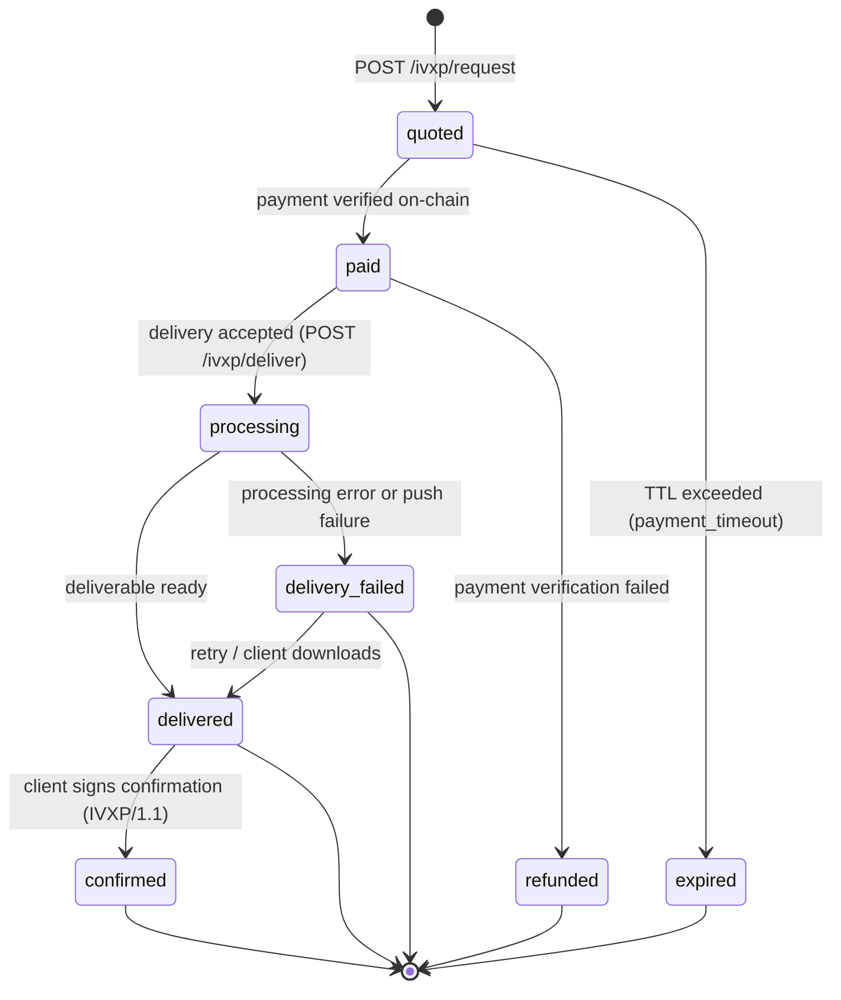
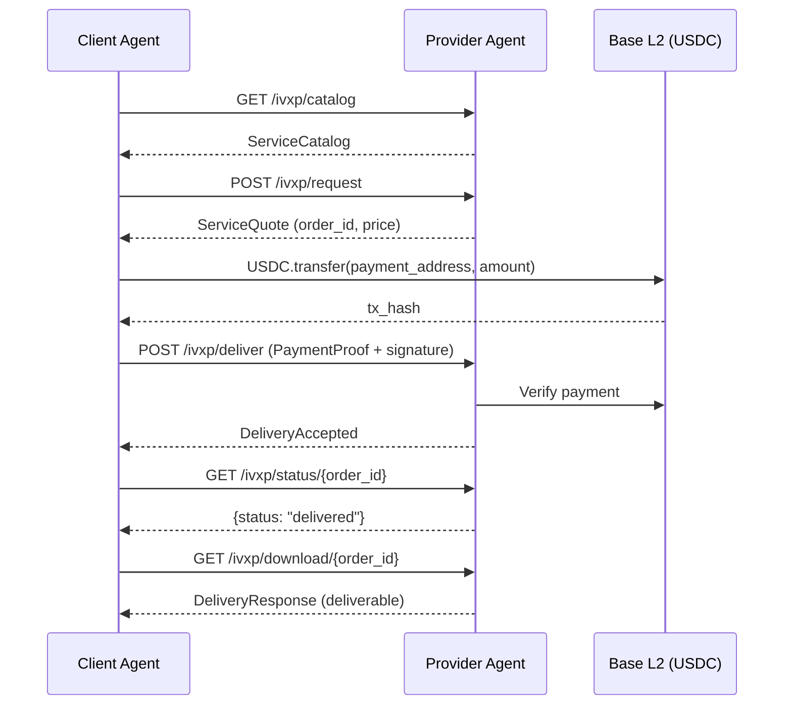

# IVXP/1.0 Order State Machine

This document describes the order lifecycle state machine for the IVXP/1.0 protocol.

## State Diagram

See also: [diagrams/state-machine.mmd](./diagrams/state-machine.mmd)

## Order States

| State | Description | Terminal |
|-------|-------------|----------|
| `quoted` | Quote issued, awaiting payment | No |
| `paid` | Payment verified on-chain, awaiting processing | No |
| `processing` | Service handler actively processing the order | No |
| `delivered` | Deliverable ready (P2P push succeeded or stored) | Yes* |
| `delivery_failed` | P2P push failed; deliverable still downloadable | No |
| `confirmed` | Client signed receipt confirmation (IVXP/1.1) | Yes |
| `expired` | Payment timeout exceeded | Yes |
| `refunded` | Payment failed post-acceptance verification | Yes |

*`delivered` is terminal in IVXP/1.0. In IVXP/1.1, it transitions to `confirmed`.

## State Transitions

### `[*]` -> `quoted`

**Trigger:** Provider receives a valid `ServiceRequest` via `POST /ivxp/request`

**Actions:**
1. Provider validates the request (service type, budget, protocol version)
2. Provider generates a unique `order_id` (format: `ivxp-{uuid-v4}`)
3. Provider creates a `ServiceQuote` with pricing and payment details
4. Order is stored with status `quoted`

**Conditions:**
- Service type must exist in the provider's catalog
- Budget must meet or exceed the base price
- Protocol version must be `"IVXP/1.0"`

### `quoted` -> `paid`

**Trigger:** On-chain USDC payment verified

**Actions:**
1. Client transfers USDC to `quote.payment_address` on the specified network
2. Provider verifies the transaction on-chain:
   - `to_address` matches `payment_address`
   - `amount` >= `price_usdc`
   - Token contract is USDC
3. Order status updated to `paid`

**Conditions:**
- Transaction must be confirmed on-chain
- Payment amount must be sufficient
- Payment must be within `payment_timeout` (if specified)

### `paid` -> `processing`

**Trigger:** Provider accepts the delivery request via `POST /ivxp/deliver`

**Actions:**
1. Client submits `DeliveryRequest` with `PaymentProof` and EIP-191 signature
2. Provider verifies:
   - Payment proof matches on-chain transaction
   - Signature is valid and matches `from_address`
3. Provider responds with `DeliveryAccepted`
4. Provider begins executing the service handler

### `processing` -> `delivered`

**Trigger:** Service handler completes and deliverable is ready

**Actions:**
1. Provider generates the deliverable content
2. Provider computes `content_hash` (SHA-256)
3. If `delivery_endpoint` was provided:
   - Provider attempts P2P push to the endpoint
   - On success, status becomes `delivered`
4. If no endpoint or push succeeds:
   - Deliverable is stored for download
   - Status becomes `delivered`

### `processing` -> `delivery_failed`

**Trigger:** Service handler fails or P2P push fails

**Actions:**
1. If processing error: order marked as `delivery_failed`
2. If P2P push fails: deliverable is stored, status is `delivery_failed`
3. Client can still download via `GET /ivxp/download/{order_id}`

**Recovery:**
- Client polls `GET /ivxp/status/{order_id}` and sees `delivery_failed`
- Client downloads deliverable via `GET /ivxp/download/{order_id}`
- Successful download effectively resolves the failure

### `quoted` -> `expired`

**Trigger:** Payment timeout exceeded

**Actions:**
1. Provider checks elapsed time against `terms.payment_timeout` (or `DEFAULT_PAYMENT_TIMEOUT` if not specified)
2. Order is marked as `expired`
3. No further transitions possible

**Timeout Resolution:**
- If `terms.payment_timeout` is present in the quote, use that value
- Otherwise, apply `DEFAULT_PAYMENT_TIMEOUT = 3600` seconds (1 hour)
- Providers MUST always enforce a timeout; there is no "infinite" timeout

### `delivered` -> `confirmed` (IVXP/1.1)

**Trigger:** Client sends a signed `DeliveryConfirmation`

**Actions:**
1. Client verifies `content_hash` matches the deliverable
2. Client signs a confirmation with EIP-191
3. Provider records the confirmation with optional `satisfaction_rating`

---

## Sequence Flows

### Happy Path: Request -> Quote -> Pay -> Deliver -> Download

See also: [diagrams/request-sequence.mmd](./diagrams/request-sequence.mmd)

### Payment Flow Detail

See: [diagrams/payment-sequence.mmd](./diagrams/payment-sequence.mmd)

### Delivery Flow Detail

See: [diagrams/delivery-sequence.mmd](./diagrams/delivery-sequence.mmd)

---

## Error States and Recovery

| Error State | Cause | Recovery |
|-------------|-------|----------|
| `expired` | Payment not received within timeout | Create a new service request |
| `refunded` | Payment verification failed after acceptance | Check transaction, retry with correct payment |
| `delivery_failed` | Processing error or P2P push failure | Download via `GET /ivxp/download/{order_id}` |

### Retry Strategy

For `delivery_failed` orders:
1. Poll `GET /ivxp/status/{order_id}` to confirm status
2. Attempt `GET /ivxp/download/{order_id}` to retrieve the deliverable
3. If deliverable is available, the order is effectively resolved
4. If deliverable is not available, contact the provider out-of-band

### Timeout Handling

- `payment_timeout` (from `QuoteTerms`): Time allowed for payment after quote
- `DEFAULT_PAYMENT_TIMEOUT = 3600` seconds (1 hour) is used when `terms.payment_timeout` is not specified
- Providers MUST always enforce a payment timeout
- After timeout, order transitions to `expired`
- Expired orders cannot be resumed; create a new request
